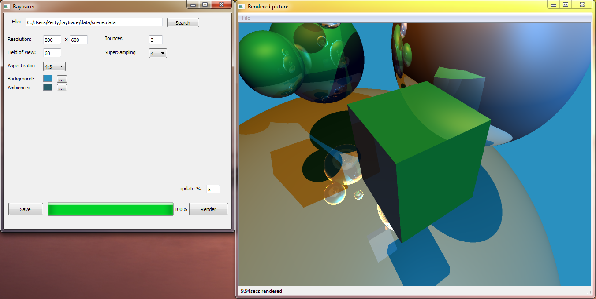

Raytracer
--------------
A simple raytracer with Qt5 GUI.

**Main part** (main structure, render algorithm, filereading) from professor.

Qt5 GUI, enhancements done by myself.

**Features:**

- Data file loading (with several parameters)
 - Quadrics
 - Spheres
- Resolution
- Field of view
- Aspect ratio
- Background color
- Ambient lighting
- Number of possible lightbounces
- SuperSampling

**possible overriding:**

Example picture:

