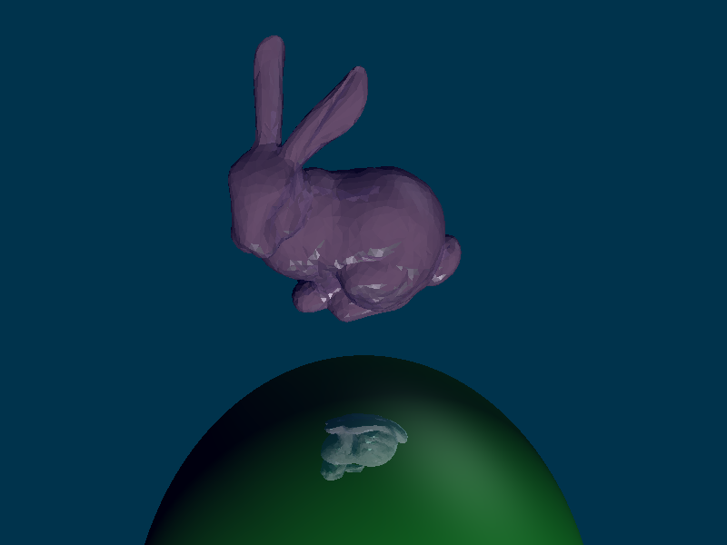

Raytracer
--------------
A simple raytracer with Qt5 GUI.

**Main part** (main structure, render algorithm, filereading) from professor.

Qt5 GUI, enhancements done by myself.

**Features:**

- SuperSampling
- Bounding Volumes
- Gouraud Shading
- Data file loading (scene-files)
 - Quadrics
 - Spheres
 - Polygons
- Save rendered Picture (BMP, JPG, JPEG, PNG, PPM, XBM, XPM) 
- Resolution
- Field of view
- Aspect ratio
- Background color
- Ambient lighting
- Number of possible lightbounces

Example pictures:

